# Trip Kit API Documentation
## RESTful API Reference - MVP v1.0

---

## 📋 Document Information

- **API Version**: 1.0.0
- **Last Updated**: 2025-12-03
- **Base URL**: `https://tripkit.vercel.app/api` (production)
- **Base URL**: `http://localhost:3000/api` (development)
- **Protocol**: HTTPS (production), HTTP (development)
- **Content-Type**: `application/json`
- **Related Documents**: [TRD](./TRD_TripKit_MVP.md), [PRD](./PRD_TripKit_MVP.md)

---

## 🔐 Authentication

**MVP Status**: No authentication required (public endpoints)

**Future Implementation**: JWT-based authentication
```typescript
// Future authentication header
Authorization: Bearer <jwt-token>
```

---

## 📊 Rate Limiting

### Limits per IP Address
| Endpoint Category | Limit | Window |
|-------------------|-------|--------|
| Chat endpoints | 100 requests | 1 hour |
| Recommendation endpoints | 50 requests | 1 hour |
| Image generation | 20 requests | 1 hour |

### Rate Limit Headers
```http
X-RateLimit-Limit: 100
X-RateLimit-Remaining: 95
X-RateLimit-Reset: 1638360000
```

### Rate Limit Error Response
```json
{
  "error": "RATE_LIMIT_EXCEEDED",
  "message": "Too many requests. Please try again in 30 minutes.",
  "retryAfter": 1800
}
```

---

## 🚨 Error Handling

### Standard Error Response
```json
{
  "error": "ERROR_CODE",
  "message": "Human-readable error message",
  "details": {
    "field": "Additional context (optional)"
  },
  "timestamp": "2025-12-03T10:30:00Z"
}
```

### Error Codes
| Code | HTTP Status | Description |
|------|-------------|-------------|
| `VALIDATION_ERROR` | 400 | Invalid request parameters |
| `UNAUTHORIZED` | 401 | Missing or invalid authentication |
| `RATE_LIMIT_EXCEEDED` | 429 | Too many requests |
| `INTERNAL_ERROR` | 500 | Server-side error |
| `OPENAI_ERROR` | 503 | External API failure |
| `TIMEOUT` | 504 | Request timeout |

### Example Error Responses

**400 Bad Request**
```json
{
  "error": "VALIDATION_ERROR",
  "message": "Invalid conversation step",
  "details": {
    "field": "currentStep",
    "received": "invalid_step",
    "expected": ["mood", "aesthetic", "duration", "interests"]
  },
  "timestamp": "2025-12-03T10:30:00Z"
}
```

**503 Service Unavailable**
```json
{
  "error": "OPENAI_ERROR",
  "message": "AI service temporarily unavailable",
  "details": {
    "provider": "OpenAI",
    "statusCode": 503
  },
  "timestamp": "2025-12-03T10:30:00Z"
}
```

---

## 📡 API Endpoints

## 1. Chat Conversation

### POST /api/chat

Process conversation messages and advance chatbot state.

#### Request

```http
POST /api/chat
Content-Type: application/json

{
  "sessionId": "550e8400-e29b-41d4-a716-446655440000",
  "message": "I'm looking for a romantic, vintage vibe trip",
  "currentStep": "mood",
  "preferences": {
    "mood": "romantic",
    "aesthetic": "vintage"
  }
}
```

#### Request Parameters

| Field | Type | Required | Description |
|-------|------|----------|-------------|
| `sessionId` | string (UUID) | Yes | Client-generated session identifier |
| `message` | string | Yes | User's chat message (max 500 chars) |
| `currentStep` | string | Yes | Current conversation step |
| `preferences` | object | No | Accumulated user preferences |

**Valid Steps**: `init`, `mood`, `aesthetic`, `duration`, `interests`, `complete`

#### Response (200 OK)

```json
{
  "reply": "Great! Romantic and vintage sounds wonderful. Are you more drawn to urban settings or natural landscapes?",
  "nextStep": "aesthetic",
  "isComplete": false,
  "recommendations": null,
  "sessionId": "550e8400-e29b-41d4-a716-446655440000"
}
```

#### Response (200 OK - Final Step)

```json
{
  "reply": "Perfect! Based on your preferences, I have some wonderful destinations for you.",
  "nextStep": "complete",
  "isComplete": true,
  "recommendations": [
    {
      "id": "dest_1",
      "name": "Cinque Terre Hidden Trails",
      "city": "Cinque Terre",
      "country": "Italy",
      "description": "Lesser-known hiking paths connecting colorful cliffside villages...",
      "matchReason": "Combines romantic coastal views with vintage Italian charm...",
      "bestTimeToVisit": "Late April - Early June",
      "photographyScore": 9,
      "transportAccessibility": "moderate",
      "safetyRating": 9
    }
  ],
  "sessionId": "550e8400-e29b-41d4-a716-446655440000"
}
```

#### Response Fields

| Field | Type | Description |
|-------|------|-------------|
| `reply` | string | AI-generated response message |
| `nextStep` | string | Next conversation step |
| `isComplete` | boolean | Whether conversation is finished |
| `recommendations` | array\|null | Destinations (only when `isComplete=true`) |
| `sessionId` | string | Session identifier |

#### cURL Example

```bash
curl -X POST https://tripkit.vercel.app/api/chat \
  -H "Content-Type: application/json" \
  -d '{
    "sessionId": "550e8400-e29b-41d4-a716-446655440000",
    "message": "I want a romantic trip",
    "currentStep": "mood",
    "preferences": {}
  }'
```

#### TypeScript Example

```typescript
const response = await fetch('/api/chat', {
  method: 'POST',
  headers: { 'Content-Type': 'application/json' },
  body: JSON.stringify({
    sessionId: crypto.randomUUID(),
    message: userMessage,
    currentStep: 'mood',
    preferences: {},
  }),
});

const data = await response.json();
console.log(data.reply);
```

---

## 2. Destination Recommendations

### POST /api/recommendations/destinations

Generate destination recommendations based on user preferences.

#### Request

```http
POST /api/recommendations/destinations
Content-Type: application/json

{
  "preferences": {
    "mood": "romantic",
    "aesthetic": "vintage",
    "duration": "medium",
    "interests": ["photography", "art"],
    "concept": "filmlog"
  }
}
```

#### Request Parameters

| Field | Type | Required | Description |
|-------|------|----------|-------------|
| `preferences.mood` | string | Yes | User's mood preference |
| `preferences.aesthetic` | string | Yes | Aesthetic preference |
| `preferences.duration` | string | Yes | Trip duration |
| `preferences.interests` | array | Yes | User interests (1-5 items) |
| `preferences.concept` | string | No | Selected concept (can be provided later) |

**Valid Values**:
- `mood`: `romantic`, `adventurous`, `nostalgic`, `peaceful`
- `aesthetic`: `urban`, `nature`, `vintage`, `modern`
- `duration`: `short` (1-3 days), `medium` (4-7 days), `long` (8+ days)
- `interests`: `photography`, `food`, `art`, `history`, `nature`, `architecture`
- `concept`: `flaneur`, `filmlog`, `midnight`

#### Response (200 OK)

```json
{
  "destinations": [
    {
      "id": "dest_abc123",
      "name": "Cinque Terre Hidden Trails",
      "city": "Cinque Terre",
      "country": "Italy",
      "description": "Lesser-known hiking paths connecting colorful cliffside villages, away from cruise ship crowds. Experience authentic Italian coastal life in five picturesque fishing villages.",
      "matchReason": "Combines romantic coastal views with vintage Italian charm, perfect for film photography. The pastel-colored buildings and dramatic cliffsides create stunning backdrops.",
      "bestTimeToVisit": "Late April - Early June (spring bloom, fewer tourists)",
      "photographyScore": 9,
      "transportAccessibility": "moderate",
      "safetyRating": 9,
      "estimatedBudget": "$$",
      "tags": ["coastal", "hiking", "photography", "authentic"]
    },
    {
      "id": "dest_def456",
      "name": "Montmartre Artist Quarter",
      "city": "Paris",
      "country": "France",
      "description": "Historic hilltop neighborhood where Picasso, Van Gogh, and Toulouse-Lautrec once lived. Cobblestone streets, hidden courtyards, and local artist studios away from tourist crowds.",
      "matchReason": "Perfect for vintage aesthetic and artistic interests. Captures the bohemian spirit of 1920s Paris with timeless charm.",
      "bestTimeToVisit": "September - October (autumn colors, post-summer crowds)",
      "photographyScore": 10,
      "transportAccessibility": "easy",
      "safetyRating": 8,
      "estimatedBudget": "$$$",
      "tags": ["urban", "art", "history", "bohemian"]
    },
    {
      "id": "dest_ghi789",
      "name": "Porto Ribeira District",
      "city": "Porto",
      "country": "Portugal",
      "description": "Riverside neighborhood with colorful tiled facades, narrow medieval streets, and traditional port wine cellars. Authentic Portuguese lifestyle at a slower pace.",
      "matchReason": "Romantic riverside setting with vintage architecture. Affordable compared to other European destinations, maintaining authentic character.",
      "bestTimeToVisit": "May - June (warm weather, before peak season)",
      "photographyScore": 8,
      "transportAccessibility": "easy",
      "safetyRating": 9,
      "estimatedBudget": "$",
      "tags": ["riverside", "wine", "architecture", "affordable"]
    }
  ],
  "generatedAt": "2025-12-03T10:30:00Z",
  "preferences": {
    "mood": "romantic",
    "aesthetic": "vintage",
    "duration": "medium",
    "interests": ["photography", "art"],
    "concept": "filmlog"
  }
}
```

#### Response Fields

| Field | Type | Description |
|-------|------|-------------|
| `destinations` | array | Array of destination objects (3 items) |
| `destinations[].id` | string | Unique destination identifier |
| `destinations[].name` | string | Destination name |
| `destinations[].city` | string | City name |
| `destinations[].country` | string | Country name |
| `destinations[].description` | string | Detailed description (100-200 words) |
| `destinations[].matchReason` | string | Why it matches user preferences |
| `destinations[].bestTimeToVisit` | string | Optimal travel period |
| `destinations[].photographyScore` | number | Photography potential (1-10) |
| `destinations[].transportAccessibility` | string | `easy`, `moderate`, `challenging` |
| `destinations[].safetyRating` | number | Safety score (1-10) |
| `destinations[].estimatedBudget` | string | `$`, `$$`, `$$$` (low/med/high) |
| `destinations[].tags` | array | Descriptive tags |
| `generatedAt` | string | ISO 8601 timestamp |
| `preferences` | object | Echo of request preferences |

#### cURL Example

```bash
curl -X POST https://tripkit.vercel.app/api/recommendations/destinations \
  -H "Content-Type: application/json" \
  -d '{
    "preferences": {
      "mood": "romantic",
      "aesthetic": "vintage",
      "duration": "medium",
      "interests": ["photography", "art"],
      "concept": "filmlog"
    }
  }'
```

#### TypeScript Example

```typescript
const response = await fetch('/api/recommendations/destinations', {
  method: 'POST',
  headers: { 'Content-Type': 'application/json' },
  body: JSON.stringify({
    preferences: {
      mood: 'romantic',
      aesthetic: 'vintage',
      duration: 'medium',
      interests: ['photography', 'art'],
      concept: 'filmlog',
    },
  }),
});

const { destinations } = await response.json();
console.log(`Found ${destinations.length} destinations`);
```

---

## 3. Hidden Spot Recommendations

### POST /api/recommendations/hidden-spots

Generate hidden, local-favorite locations for a selected destination.

#### Request

```http
POST /api/recommendations/hidden-spots
Content-Type: application/json

{
  "destinationId": "dest_abc123",
  "concept": "filmlog",
  "preferences": {
    "mood": "romantic",
    "interests": ["photography"]
  }
}
```

#### Request Parameters

| Field | Type | Required | Description |
|-------|------|----------|-------------|
| `destinationId` | string | Yes | Selected destination ID |
| `concept` | string | Yes | Selected aesthetic concept |
| `preferences` | object | No | User preferences for context |

#### Response (200 OK)

```json
{
  "hiddenSpots": [
    {
      "id": "spot_xyz789",
      "name": "Via dell'Amore Secret Overlook",
      "address": "Path 2, Riomaggiore to Manarola, Cinque Terre",
      "coordinates": {
        "lat": 44.0996,
        "lng": 9.7368
      },
      "description": "A quiet observation point above the famous lovers' path, offering panoramic views without the crowds. Local fishermen know this spot for stunning sunset backdrops with the entire coastline visible.",
      "photographyTips": [
        "Golden hour: 30min before sunset for warm light",
        "Use wide aperture (f/1.8-2.8) for bokeh effect",
        "Frame with olive trees in foreground",
        "Shoot towards the ocean for dramatic cliffs",
        "Bring ND filter for long exposure of waves"
      ],
      "bestTimeToVisit": "Sunrise (6:30 AM) or Sunset (7:00 PM)",
      "estimatedDuration": "45min - 1hr",
      "nearbyAmenities": [
        "Trattoria dal Billy (5min walk)",
        "Public restroom at trail entrance",
        "Small grocery store in Manarola (10min)"
      ],
      "accessibilityNotes": "Requires 10min uphill hike on uneven terrain. Wear comfortable shoes. Not wheelchair accessible.",
      "crowdLevel": "low",
      "localTip": "Visit on weekday mornings to avoid even the small number of tourists who know about this spot.",
      "filmRecommendations": [
        {
          "filmStock": "Kodak ColorPlus 200",
          "reason": "Captures warm coastal light beautifully, enhances golden hour tones"
        },
        {
          "filmStock": "Fujifilm Superia 400",
          "reason": "Versatile for changing light conditions, vibrant colors for the sea"
        }
      ],
      "safetyNotes": "Stay on marked paths. Cliff edges are not fenced. Avoid during rain (slippery)."
    },
    {
      "id": "spot_abc456",
      "name": "Vernazza Fisherman's Wharf",
      "address": "Harbor area, Vernazza, Cinque Terre",
      "coordinates": {
        "lat": 44.1347,
        "lng": 9.6841
      },
      "description": "Working fishing harbor where locals repair nets and boats early morning. Authentic maritime atmosphere with colorful fishing boats against pastel village backdrop.",
      "photographyTips": [
        "Blue hour: 6:00-6:30 AM for moody atmosphere",
        "Capture fishermen at work for authenticity",
        "Low angle shots from dock level",
        "Include fishing nets as foreground texture",
        "Reflections in calm harbor water"
      ],
      "bestTimeToVisit": "Early morning (6:00-8:00 AM) when fishermen are active",
      "estimatedDuration": "30min - 1hr",
      "nearbyAmenities": [
        "Café Matteo (opens 7:00 AM)",
        "Public restroom near church",
        "Fresh seafood market (8:00 AM opening)"
      ],
      "accessibilityNotes": "Flat, easy access from village center. Wheelchair friendly dock area.",
      "crowdLevel": "low (morning), medium (afternoon)",
      "localTip": "Strike up conversation with fishermen Luigi or Marco—they love sharing stories and may let you photograph their work up close.",
      "filmRecommendations": [
        {
          "filmStock": "Kodak Portra 400",
          "reason": "Beautiful skin tones for portraits of fishermen, handles mixed lighting well"
        }
      ],
      "safetyNotes": "Watch for wet surfaces near docks. Stay out of working areas when boats are moving."
    }
  ],
  "destinationId": "dest_abc123",
  "destinationName": "Cinque Terre Hidden Trails",
  "totalSpots": 8,
  "generatedAt": "2025-12-03T10:35:00Z"
}
```

#### Response Fields

| Field | Type | Description |
|-------|------|-------------|
| `hiddenSpots` | array | Array of hidden spot objects (5-10 items) |
| `hiddenSpots[].id` | string | Unique spot identifier |
| `hiddenSpots[].name` | string | Location name |
| `hiddenSpots[].address` | string | Full address |
| `hiddenSpots[].coordinates` | object | GPS coordinates (optional) |
| `hiddenSpots[].description` | string | Detailed description (50-150 words) |
| `hiddenSpots[].photographyTips` | array | Photography advice (3-7 tips) |
| `hiddenSpots[].bestTimeToVisit` | string | Optimal visiting time |
| `hiddenSpots[].estimatedDuration` | string | Visit duration |
| `hiddenSpots[].nearbyAmenities` | array | Nearby facilities |
| `hiddenSpots[].accessibilityNotes` | string | Accessibility information |
| `hiddenSpots[].crowdLevel` | string | `low`, `medium`, `high` |
| `hiddenSpots[].localTip` | string | Insider advice from locals |
| `hiddenSpots[].filmRecommendations` | array | Film stock suggestions |
| `hiddenSpots[].safetyNotes` | string | Safety information |
| `destinationId` | string | Reference to parent destination |
| `destinationName` | string | Parent destination name |
| `totalSpots` | number | Total number of spots generated |
| `generatedAt` | string | ISO 8601 timestamp |

#### cURL Example

```bash
curl -X POST https://tripkit.vercel.app/api/recommendations/hidden-spots \
  -H "Content-Type: application/json" \
  -d '{
    "destinationId": "dest_abc123",
    "concept": "filmlog",
    "preferences": {
      "mood": "romantic",
      "interests": ["photography"]
    }
  }'
```

---

## 4. Image Generation

### POST /api/generate/image

Generate AI preview image for a specific location.

#### Request

```http
POST /api/generate/image
Content-Type: application/json

{
  "locationId": "spot_xyz789",
  "locationName": "Via dell'Amore Secret Overlook",
  "locationDescription": "Quiet observation point with panoramic coastal views...",
  "concept": "filmlog",
  "filmStock": "kodak_colorplus",
  "outfitStyle": "Vintage denim jacket, white sundress",
  "userPhoto": null,
  "timeOfDay": "sunset",
  "composition": "right-third",
  "expression": "gentle smile"
}
```

#### Request Parameters

| Field | Type | Required | Description |
|-------|------|----------|-------------|
| `locationId` | string | Yes | Hidden spot ID |
| `locationName` | string | Yes | Location name |
| `locationDescription` | string | Yes | Location description |
| `concept` | string | Yes | Selected concept |
| `filmStock` | string | Yes | Film stock aesthetic |
| `outfitStyle` | string | Yes | Outfit description |
| `userPhoto` | string\|null | No | Base64 image or URL (MVP: optional) |
| `timeOfDay` | string | No | `morning`, `noon`, `sunset`, `night` |
| `composition` | string | No | `center`, `left-third`, `right-third` |
| `expression` | string | No | Facial expression description |

**Valid Film Stocks**:
- `kodak_colorplus`: Warm, saturated tones
- `kodak_portra`: Natural skin tones, subtle colors
- `fuji_superia`: Vibrant, saturated colors
- `ilford_hp5`: Monochrome, high contrast

#### Response (200 OK - Immediate Success)

```json
{
  "imageUrl": "https://oaidalleapiprodscus.blob.core.windows.net/private/org-abc/user-xyz/img-123.png?st=2025-12-03T10%3A40%3A00Z&se=2025-12-03T11%3A40%3A00Z&sp=r&sv=2021-08-06&sr=b&sig=abc123",
  "prompt": "Create a high-quality photograph in the style of Kodak ColorPlus 200 film.\n\nScene Description:\nQuiet observation point with panoramic coastal views above Via dell'Amore, Cinque Terre. Dramatic cliffs, turquoise sea, and colorful villages in the distance.\n\nSubject:\n- Young woman wearing vintage denim jacket and white sundress\n- Holding vintage 35mm film camera (Canon AE-1)\n- Natural, candid pose\n- Looking towards ocean with gentle smile\n\nFilm Aesthetic:\n- Fine grain texture\n- Warm, saturated Kodak ColorPlus color profile\n- Slight vignetting\n- Natural sunset lighting\n- Bokeh from background elements\n\nComposition:\n- Subject positioned in right third of frame\n- Coastal cliffs and village in background\n- Depth of field: f/1.8\n- Authentic analog film look\n\nStyle: Cinematic, nostalgic, highly detailed, professional film photography",
  "generationTime": 12453,
  "status": "success",
  "metadata": {
    "model": "dall-e-3",
    "size": "1024x1024",
    "quality": "hd",
    "revisedPrompt": "A detailed image capturing a young woman..."
  }
}
```

#### Response (202 Accepted - Async Processing)

```json
{
  "taskId": "task_img_abc123",
  "status": "pending",
  "estimatedWait": 15000,
  "pollUrl": "/api/generate/image/task_img_abc123",
  "message": "Image generation in progress. Use pollUrl to check status."
}
```

#### Polling Endpoint: GET /api/generate/image/:taskId

**Response (200 OK - Still Processing)**
```json
{
  "taskId": "task_img_abc123",
  "status": "pending",
  "progress": 65,
  "message": "Generating image..."
}
```

**Response (200 OK - Success)**
```json
{
  "taskId": "task_img_abc123",
  "status": "success",
  "imageUrl": "https://oaidalleapiprodscus.blob.core.windows.net/...",
  "prompt": "...",
  "generationTime": 15230
}
```

**Response (200 OK - Failed)**
```json
{
  "taskId": "task_img_abc123",
  "status": "failed",
  "errorMessage": "Content policy violation detected",
  "errorCode": "CONTENT_POLICY_VIOLATION"
}
```

#### Response Fields

| Field | Type | Description |
|-------|------|-------------|
| `imageUrl` | string | Generated image URL (expires in 1 hour) |
| `prompt` | string | Full DALL-E 3 prompt used |
| `generationTime` | number | Generation time in milliseconds |
| `status` | string | `success`, `pending`, `failed` |
| `taskId` | string | Task ID for async operations |
| `pollUrl` | string | URL to poll for async status |
| `metadata` | object | Additional generation metadata |
| `errorMessage` | string | Error description (if failed) |

#### cURL Example (Synchronous)

```bash
curl -X POST https://tripkit.vercel.app/api/generate/image \
  -H "Content-Type: application/json" \
  -d '{
    "locationId": "spot_xyz789",
    "locationName": "Via dell'\''Amore Secret Overlook",
    "locationDescription": "Quiet coastal overlook with panoramic views",
    "concept": "filmlog",
    "filmStock": "kodak_colorplus",
    "outfitStyle": "Vintage denim jacket, white sundress",
    "timeOfDay": "sunset"
  }'
```

#### TypeScript Example (Async with Polling)

```typescript
// Initial request
const response = await fetch('/api/generate/image', {
  method: 'POST',
  headers: { 'Content-Type': 'application/json' },
  body: JSON.stringify({
    locationId: 'spot_xyz789',
    locationName: 'Via dell\'Amore Secret Overlook',
    locationDescription: 'Quiet coastal overlook...',
    concept: 'filmlog',
    filmStock: 'kodak_colorplus',
    outfitStyle: 'Vintage denim jacket, white sundress',
  }),
});

const initialData = await response.json();

if (initialData.status === 'pending') {
  // Poll for completion
  const pollInterval = setInterval(async () => {
    const pollResponse = await fetch(initialData.pollUrl);
    const pollData = await pollResponse.json();

    if (pollData.status === 'success') {
      clearInterval(pollInterval);
      console.log('Image ready:', pollData.imageUrl);
    } else if (pollData.status === 'failed') {
      clearInterval(pollInterval);
      console.error('Generation failed:', pollData.errorMessage);
    }
  }, 2000); // Poll every 2 seconds
} else if (initialData.status === 'success') {
  console.log('Image ready immediately:', initialData.imageUrl);
}
```

---

## 5. Styling & Film Recommendations

### POST /api/recommendations/styling

Get comprehensive film camera, outfit, and prop recommendations.

#### Request

```http
POST /api/recommendations/styling
Content-Type: application/json

{
  "locationId": "spot_xyz789",
  "concept": "filmlog",
  "timeOfDay": "sunset",
  "weather": "clear",
  "season": "spring"
}
```

#### Request Parameters

| Field | Type | Required | Description |
|-------|------|----------|-------------|
| `locationId` | string | Yes | Hidden spot ID |
| `concept` | string | Yes | Selected aesthetic concept |
| `timeOfDay` | string | No | Time of visit |
| `weather` | string | No | Weather conditions |
| `season` | string | No | Season of visit |

#### Response (200 OK)

```json
{
  "cameraModel": "Canon AE-1",
  "cameraDescription": "Classic 35mm SLR beloved by film photographers. Reliable, affordable, and produces excellent results with any film stock.",
  "rentalInfo": {
    "available": true,
    "estimatedCost": "$25-35/day",
    "whereToRent": "Local camera shops, Lomography store, online (KehCamera.com)"
  },
  "filmStock": {
    "name": "Kodak ColorPlus 200",
    "iso": 200,
    "colorProfile": "Warm, saturated tones with slight red-orange shift. Budget-friendly yet delivers beautiful results.",
    "characteristics": [
      "Affordable (~$8/roll)",
      "Versatile for various lighting",
      "Great for travel and landscapes",
      "Warm color palette perfect for sunsets",
      "Fine grain structure"
    ],
    "sampleImages": [
      "https://filmsamples.com/kodak-colorplus-sunset-1.jpg",
      "https://filmsamples.com/kodak-colorplus-portrait-2.jpg",
      "https://filmsamples.com/kodak-colorplus-landscape-3.jpg"
    ],
    "priceRange": "$",
    "exposuresPerRoll": 36,
    "bestFor": ["Sunsets", "Portraits", "Travel", "Golden hour"]
  },
  "cameraSettings": {
    "aperture": "f/2.8",
    "shutterSpeed": "1/250s",
    "iso": 200,
    "focusMode": "auto",
    "meteringMode": "Center-weighted average",
    "lightingNotes": "Sunset provides soft, warm directional light. Meter for highlights to avoid overexposure. Aim for slightly underexposed to preserve sky detail.",
    "advancedTips": [
      "Use spot metering if subject is backlit",
      "Bracket exposures (+/- 1 stop) for safety",
      "Shoot at f/1.8 for maximum bokeh if available"
    ]
  },
  "outfitSuggestions": {
    "colorPalette": [
      "#F5E6D3",
      "#8B7355",
      "#FFFFFF",
      "#A0826D"
    ],
    "colorNames": [
      "Cream",
      "Tan",
      "White",
      "Dusty Rose"
    ],
    "style": "Casual vintage, relaxed coastal chic",
    "specificItems": [
      "Vintage denim jacket (light wash, slightly oversized)",
      "White linen sundress or midi skirt",
      "Woven straw hat with ribbon detail",
      "Leather sandals or espadrilles",
      "Delicate gold jewelry (simple necklace, small earrings)"
    ],
    "seasonalNotes": "Layers for evening breeze coming off the sea. Breathable fabrics for warm afternoon. Bring light cardigan.",
    "avoidItems": [
      "Bright neon colors (clash with film aesthetic)",
      "Heavy patterns (distract from scenery)",
      "Athletic wear (doesn't fit vintage vibe)"
    ],
    "shoppingTips": "Check local vintage shops in Cinque Terre villages for authentic Italian pieces. Thrift stores often have perfect linen items."
  },
  "props": [
    {
      "name": "Vintage Polaroid camera",
      "purpose": "Add nostalgic element and creates interesting layers in composition",
      "whereToFind": "Bring from home, or check Mercato di Mezzo in La Spezia (vintage market)",
      "optional": false,
      "stylingTips": "Hold casually, not posed. Use as natural gesture while looking at view."
    },
    {
      "name": "Woven basket with local flowers",
      "purpose": "Coastal aesthetic enhancement, adds color and texture",
      "whereToFind": "Local markets in Riomaggiore (Tuesday mornings), or pick wildflowers on trails",
      "optional": true,
      "stylingTips": "Fill with colorful wildflowers or fresh herbs. Carry naturally on arm."
    },
    {
      "name": "Vintage map or travel journal",
      "purpose": "Storytelling element, suggests exploration and adventure",
      "whereToFind": "Bookstores in Monterosso, or bring personal travel journal",
      "optional": true,
      "stylingTips": "Hold open as if checking directions. Creates sense of journey."
    }
  ],
  "bestAngles": [
    {
      "description": "Rule of thirds with horizon line",
      "visualExample": "https://angles.tripkit.com/rule-of-thirds-sunset.jpg",
      "technique": "Position subject in right third of frame, ocean and cliffs in left two-thirds. Keep horizon in upper or lower third, not center.",
      "bestLighting": "15-30 minutes before sunset (golden hour)",
      "cameraHeight": "Eye-level or slightly below",
      "diagramUrl": "https://angles.tripkit.com/diagrams/rule-of-thirds.svg"
    },
    {
      "description": "Bokeh with coastal background",
      "visualExample": "https://angles.tripkit.com/bokeh-coast.jpg",
      "technique": "Use f/1.8-2.8 aperture, focus sharply on subject's face, let colorful village background blur beautifully. Maximize distance between subject and background.",
      "bestLighting": "Soft diffused light (cloudy or shade)",
      "cameraHeight": "Eye-level, slightly above to show coastline behind",
      "diagramUrl": "https://angles.tripkit.com/diagrams/bokeh.svg"
    },
    {
      "description": "Leading lines with path",
      "visualExample": "https://angles.tripkit.com/leading-lines.jpg",
      "technique": "Use path, railings, or cliff edge to create natural lines leading viewer's eye to subject. Position subject at vanishing point.",
      "bestLighting": "Any time, but avoid harsh midday sun",
      "cameraHeight": "Low angle to emphasize path perspective",
      "diagramUrl": "https://angles.tripkit.com/diagrams/leading-lines.svg"
    },
    {
      "description": "Silhouette against sunset",
      "visualExample": "https://angles.tripkit.com/silhouette-sunset.jpg",
      "technique": "Position subject between camera and setting sun. Meter for bright sky, allowing subject to underexpose into silhouette. Shoot at f/8-11 for sunstar effect.",
      "bestLighting": "Directly at sunset (last 10 minutes)",
      "cameraHeight": "Low angle to capture full sky behind subject",
      "diagramUrl": "https://angles.tripkit.com/diagrams/silhouette.svg"
    }
  ],
  "locationSpecificTips": {
    "localInsights": "Fishermen and locals prefer early morning light (6:00-7:00 AM) when the air is clearest. Evening light is warmer but more hazy.",
    "weatherConsiderations": "Sea breeze picks up after 2:00 PM—secure hats and lightweight items. Morning is calmer for still compositions.",
    "crowdAvoidance": "Visit 30min before sunset, not during sunset peak. Weekday mornings have virtually no other photographers.",
    "seasonalNotes": "Spring (April-May) offers wildflowers and greenery. Summer (June-August) is warmest but more crowded. Fall (September-October) has golden light and fewer tourists."
  },
  "additionalRecommendations": {
    "backupFilmStocks": [
      {
        "name": "Fujifilm Superia 400",
        "reason": "If lighting is variable or you want faster shutter speeds"
      },
      {
        "name": "Kodak Portra 400",
        "reason": "If you want more natural skin tones and subtle colors"
      }
    ],
    "learningResources": [
      "YouTube: 'Film Photography Basics' by Negative Lab Pro",
      "Website: 35mmc.com (film camera reviews and tips)",
      "Instagram: @kodak for ColorPlus inspiration"
    ]
  },
  "generatedAt": "2025-12-03T10:45:00Z"
}
```

#### Response Fields

| Field | Type | Description |
|-------|------|-------------|
| `cameraModel` | string | Recommended camera model |
| `cameraDescription` | string | Camera details |
| `rentalInfo` | object | Rental availability and cost |
| `filmStock` | object | Detailed film stock recommendation |
| `cameraSettings` | object | Optimal camera settings |
| `outfitSuggestions` | object | Complete styling guide |
| `props` | array | Recommended props (2-4 items) |
| `bestAngles` | array | Photography composition techniques (3-5) |
| `locationSpecificTips` | object | Location-specific advice |
| `additionalRecommendations` | object | Backup options and resources |

#### cURL Example

```bash
curl -X POST https://tripkit.vercel.app/api/recommendations/styling \
  -H "Content-Type: application/json" \
  -d '{
    "locationId": "spot_xyz789",
    "concept": "filmlog",
    "timeOfDay": "sunset",
    "weather": "clear"
  }'
```

---

## 📚 Common Use Cases & Workflows

### Workflow 1: Complete User Journey

```mermaid
sequenceDiagram
    participant U as User
    participant C as Client
    participant A as API

    U->>C: Start conversation
    C->>A: POST /api/chat (step: init)
    A-->>C: Welcome message

    loop Conversation (5-7 exchanges)
        U->>C: Respond to questions
        C->>A: POST /api/chat (step: mood/aesthetic/duration/interests)
        A-->>C: Next question
    end

    A-->>C: isComplete=true, recommendations=[3 destinations]

    U->>C: Select destination
    U->>C: Choose concept (Flâneur/Film Log/Midnight)

    C->>A: POST /api/recommendations/hidden-spots
    A-->>C: 5-10 hidden spots

    U->>C: Select spot

    C->>A: POST /api/generate/image
    A-->>C: Generated preview image

    C->>A: POST /api/recommendations/styling
    A-->>C: Complete styling package

    U->>C: Save/export recommendations
```



### Workflow 2: Quick Recommendation (Skip Chat)

```typescript
// For users who want to skip conversation
async function quickRecommendation() {
  // 1. Get recommendations directly
  const { destinations } = await fetch('/api/recommendations/destinations', {
    method: 'POST',
    headers: { 'Content-Type': 'application/json' },
    body: JSON.stringify({
      preferences: {
        mood: 'romantic',
        aesthetic: 'vintage',
        duration: 'medium',
        interests: ['photography'],
        concept: 'filmlog',
      },
    }),
  }).then(r => r.json());

  // 2. Select first destination
  const destination = destinations[0];

  // 3. Get hidden spots
  const { hiddenSpots } = await fetch('/api/recommendations/hidden-spots', {
    method: 'POST',
    headers: { 'Content-Type': 'application/json' },
    body: JSON.stringify({
      destinationId: destination.id,
      concept: 'filmlog',
    }),
  }).then(r => r.json());

  return { destination, hiddenSpots };
}
```

### Workflow 3: Batch Image Generation

```typescript
// Generate images for multiple locations
async function generateImagesForAllSpots(spots, concept) {
  const imagePromises = spots.map(spot =>
    fetch('/api/generate/image', {
      method: 'POST',
      headers: { 'Content-Type': 'application/json' },
      body: JSON.stringify({
        locationId: spot.id,
        locationName: spot.name,
        locationDescription: spot.description,
        concept,
        filmStock: 'kodak_colorplus',
        outfitStyle: getOutfitForConcept(concept),
      }),
    }).then(r => r.json())
  );

  const images = await Promise.allSettled(imagePromises);

  return images.map((result, index) => ({
    spotId: spots[index].id,
    status: result.status,
    image: result.status === 'fulfilled' ? result.value : null,
  }));
}
```

---

## 🧪 Testing & Development

### Test Data

#### Sample Session ID
```
550e8400-e29b-41d4-a716-446655440000
```

#### Sample Preferences
```json
{
  "mood": "romantic",
  "aesthetic": "vintage",
  "duration": "medium",
  "interests": ["photography", "art"],
  "concept": "filmlog"
}
```

#### Sample Destination ID
```
dest_abc123
```

#### Sample Spot ID
```
spot_xyz789
```

### Postman Collection

Import this collection for easy testing:

```json
{
  "info": {
    "name": "Trip Kit API",
    "schema": "https://schema.getpostman.com/json/collection/v2.1.0/collection.json"
  },
  "item": [
    {
      "name": "Chat - Init",
      "request": {
        "method": "POST",
        "header": [{ "key": "Content-Type", "value": "application/json" }],
        "body": {
          "mode": "raw",
          "raw": "{\n  \"sessionId\": \"{{sessionId}}\",\n  \"message\": \"I want a romantic trip\",\n  \"currentStep\": \"init\",\n  \"preferences\": {}\n}"
        },
        "url": { "raw": "{{baseUrl}}/api/chat" }
      }
    },
    {
      "name": "Get Destinations",
      "request": {
        "method": "POST",
        "header": [{ "key": "Content-Type", "value": "application/json" }],
        "body": {
          "mode": "raw",
          "raw": "{\n  \"preferences\": {\n    \"mood\": \"romantic\",\n    \"aesthetic\": \"vintage\",\n    \"duration\": \"medium\",\n    \"interests\": [\"photography\", \"art\"],\n    \"concept\": \"filmlog\"\n  }\n}"
        },
        "url": { "raw": "{{baseUrl}}/api/recommendations/destinations" }
      }
    }
  ]
}
```

### Environment Variables (Postman)
```json
{
  "baseUrl": "http://localhost:3000",
  "sessionId": "550e8400-e29b-41d4-a716-446655440000"
}
```

---

## 📊 Monitoring & Analytics

### Recommended Metrics to Track

1. **API Performance**
   - Response times per endpoint
   - Error rates
   - Rate limit hits

2. **User Behavior**
   - Conversation completion rate
   - Average questions to completion
   - Most selected concepts
   - Image generation success rate

3. **Business Metrics**
   - Daily active users
   - Recommendation acceptance rate
   - Popular destinations
   - Average session duration

### Example Analytics Events

```typescript
// Track recommendation generated
analytics.track('recommendation_generated', {
  userId: sessionId,
  destinationCount: 3,
  generationTimeMs: 4500,
  concept: 'filmlog',
});

// Track image generated
analytics.track('image_generated', {
  userId: sessionId,
  locationId: 'spot_xyz789',
  filmStock: 'kodak_colorplus',
  success: true,
  generationTimeMs: 12500,
});

// Track conversation completed
analytics.track('conversation_completed', {
  userId: sessionId,
  totalMessages: 7,
  durationMs: 180000,
  preferences: { mood: 'romantic', aesthetic: 'vintage' },
});
```

---

## 🚀 Migration & Versioning

### API Versioning Strategy

**Current Version**: v1.0 (MVP)
**Versioning Method**: URL-based (future)

```
Current:  /api/chat
Future:   /api/v1/chat
          /api/v2/chat (breaking changes)
```

### Deprecation Policy

1. New version announced 3 months in advance
2. Old version supported for 6 months minimum
3. Deprecation warnings in headers:
   ```http
   Deprecation: true
   Sunset: Wed, 01 Jan 2026 00:00:00 GMT
   Link: <https://docs.tripkit.com/migration/v2>; rel="deprecation"
   ```

---

## 📞 Support & Contact

### Documentation
- **Full Docs**: https://docs.tripkit.com
- **API Reference**: https://docs.tripkit.com/api
- **Status Page**: https://status.tripkit.com

### Support Channels
- **Email**: dev@tripkit.com
- **Discord**: https://discord.gg/tripkit
- **GitHub Issues**: https://github.com/tripkit/api/issues

### SLA & Uptime
- **Target Uptime**: 99.5% (MVP), 99.9% (post-MVP)
- **Maintenance Windows**: Sundays 2:00-4:00 AM UTC
- **Incident Response**: <1 hour for critical issues

---

## 📝 Changelog

### v1.0.0 (2025-12-03)
- ✨ Initial MVP release
- 🚀 5 core endpoints operational
- 🎯 LangGraph-powered chatbot
- 🖼️ DALL-E 3 image generation
- 📍 Hidden spot recommendations
- 📷 Film camera & styling recommendations

---

**API Documentation Version**: 1.0.0
**Last Updated**: 2025-12-03
**Status**: ✅ Production Ready (MVP)
